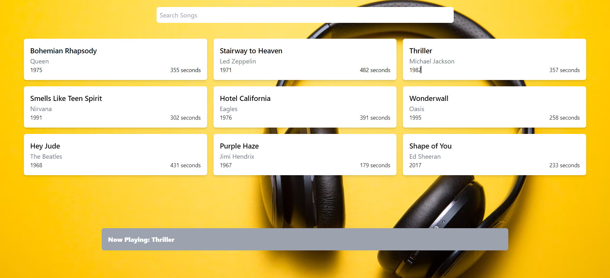

# MUSIC PLAYER - React Project with Tailwind CSS

This project is a React application that utilizes Tailwind CSS for styling. 

## Components
In the `src` folder, we created a `components` folder where we added 3 JSX files:
- `SongCards.jsx`
- `SongsDB.jsx`

## SongsDB
The `SongsDB.jsx` file contains 9 randomly generated songs, each with a unique `id`, `title`, `artist`, `duration`, and `year`.

## SongCards
The `SongCards.jsx` file displays the songs as a grid with 3 rows. The `Song` prop is used to handle searching for songs using the search input.

## HandleSearch Function
The `handleSearch` function takes the search bar input target value and passes it to the `filteredSongs` function to fetch the songs that are equal to the search value using the `SongCards` component.

Overall, this React project utilizes Tailwind CSS for styling and includes components for searching and displaying songs.
